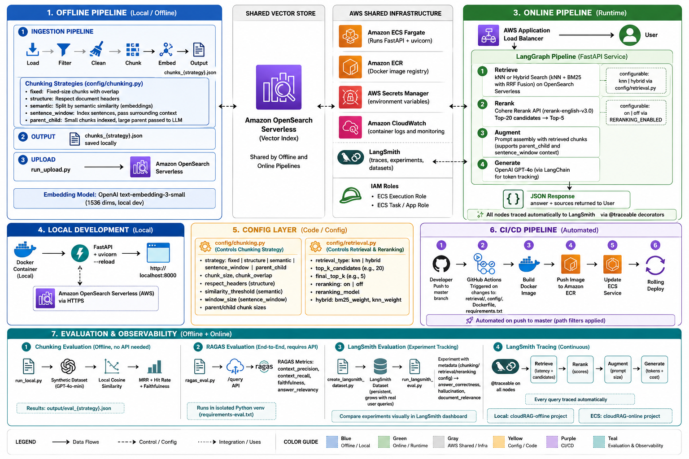

# cloudRAG

A production-grade Retrieval-Augmented Generation (RAG) system built on AWS, using LangGraph for pipeline orchestration and LangSmith for observability.

---

## Architecture



---

## Architecture Overview

The system is split into two independent pipelines:

### Offline Pipeline (Ingestion)
Responsible for processing and indexing documents into the vector store. This pipeline runs **manually from local** whenever new documents need to be ingested.

```
Markdown / MDX Files
      ↓
  Load Node       → reads files recursively, extracts frontmatter + folder hierarchy as metadata
      ↓
  Filter Node     → discards noise (MediaWiki system pages, empty pages, navigation-only docs)
      ↓
  Clean Node      → removes boilerplate (redundant headers, navigation artifacts, horizontal rules)
      ↓
  Chunk Node      → fixed-size or structure-aware chunking (configurable via config/chunking.py)
      ↓
  Embed Node      → OpenAI text-embedding-3-small (1536 dims, local dev)
                    Amazon Bedrock Titan Embeddings v2 (1024 dims, production)
      ↓
  [saved to output/chunks_{strategy}.json]
      ↓
  run_upload.py   → upsert to Amazon OpenSearch Serverless
```

### Offline Evaluation
Before uploading to OpenSearch, the pipeline evaluates chunking quality locally:

```
chunks_{strategy}.json
      ↓
  Synthetic dataset   → GPT-4o-mini generates (query, chunk_id) pairs per chunk
      ↓
  Local retrieval     → cosine similarity with numpy (no OpenSearch needed)
      ↓
  MRR + Hit Rate      → did the retriever find the right chunk?
      ↓
  Faithfulness        → does the retrieved chunk fully answer the query?
```

### Online Pipeline (Retrieval API)
A continuously running service on AWS ECS, automatically updated on every push to `master`.

```
User Query
      ↓
  ALB             → public HTTPS endpoint
      ↓
  Retrieve Node   → kNN or Hybrid search (kNN + BM25 with RRF) on OpenSearch Serverless
                    configurable via config/retrieval.py (RETRIEVAL_STRATEGY)
      ↓
  Rerank Node     → Cohere Rerank API — top-20 candidates → top-5 final
                    configurable via RERANKING_ENABLED
      ↓
  Augment Node    → context assembly with reranked chunks
      ↓
  Generate Node   → OpenAI GPT-4o
      ↓
  Response: { answer, sources }
```

---

## Tech Stack

| Component | Technology |
|---|---|
| Pipeline orchestration | LangGraph |
| Observability | LangSmith |
| Embeddings (dev) | OpenAI text-embedding-3-small (1536 dims) |
| Embeddings (prod) | Amazon Bedrock Titan Embeddings v2 (1024 dims) |
| Vector store | Amazon OpenSearch Serverless |
| LLM (online) | OpenAI GPT-4o |
| Evaluation | OpenAI GPT-4o-mini |
| API | FastAPI + uvicorn |
| Infrastructure | Terraform |
| Container registry | Amazon ECR |
| Container runtime | Amazon ECS (Fargate) |
| Load balancer | AWS ALB |
| Secrets | AWS Secrets Manager |
| CI/CD | GitHub Actions |
| Local environment | Docker (PyCharm interpreter) |

---

## Project Structure

```
cloudRAG/
├── config/
│   ├── chunking.py             # Chunking strategy + evaluation config
│   └── retrieval.py            # Retrieval strategy (knn/hybrid), reranking, top-k
├── ingestion/                  # Offline ingestion pipeline
│   ├── graph.py                # LangGraph graph: load → filter → clean → chunk → embed
│   ├── models.py               # Document and Chunk dataclasses
│   ├── state.py                # LangGraph shared state definition
│   └── nodes/
│       ├── loader.py           # Reads .md/.mdx recursively, extracts folder hierarchy
│       ├── filter.py           # Discards noisy/empty documents
│       ├── cleaner.py          # Removes MediaWiki boilerplate
│       ├── chunker.py          # fixed, structure, semantic, sentence_window, parent_child
│       └── embedder.py         # Embeddings with throttle protection
├── evaluation/
│   ├── dataset.py              # Synthetic query generation with GPT-4o-mini
│   ├── retriever.py            # Local cosine similarity search (numpy)
│   ├── metrics.py              # MRR and Hit Rate
│   ├── faithfulness.py         # Chunk completeness evaluation with GPT-4o-mini
│   └── ragas_eval.py           # End-to-end pipeline evaluation with RAGAS
├── retrieval/                  # Online pipeline
│   ├── api.py                  # FastAPI app — POST /query, GET /health
│   ├── graph.py                # LangGraph graph: retrieve → augment → generate
│   ├── models.py               # QueryRequest, QueryResponse, RetrievedChunk
│   ├── state.py                # RetrievalState
│   └── nodes/
│       ├── retriever.py        # kNN or hybrid search (RRF) on OpenSearch
│       ├── reranker.py         # Cohere Rerank API — top-20 → top-5
│       ├── augmenter.py        # Prompt assembly with reranked chunks
│       └── generator.py        # GPT-4o generation
├── infra/                      # Terraform — all infrastructure as code
│   ├── main.tf                 # Provider config and default tags
│   ├── variables.tf            # Input variables
│   ├── opensearch.tf           # OpenSearch Serverless + IAM role
│   ├── ecr.tf                  # ECR repository + lifecycle policy
│   ├── ecs.tf                  # ECS cluster + task definition + service
│   ├── networking.tf           # VPC + subnets + security groups + ALB
│   ├── outputs.tf              # Outputs: endpoints, URLs, ARNs
│   ├── dev.tfvars              # Dev environment values (not committed)
│   └── prod.tfvars             # Prod environment values (not committed)
├── .github/
│   └── workflows/
│       └── deploy.yml          # CI/CD: build → ECR → ECS on every push to master
├── data/                       # Input markdown/mdx files (not committed)
├── output/                     # chunks_{strategy}.json + eval_{strategy}.json (not committed)
├── Dockerfile                  # Online pipeline — starts uvicorn
├── requirements.txt
├── requirements-eval.txt       # Separate dependencies for RAGAS evaluation (isolated venv)
├── .env                        # Local secrets (not committed)
├── run_local.py                # Ingestion + evaluation locally (no OpenSearch needed)
├── run_upload.py               # Uploads chunks to OpenSearch Serverless
├── verify_upload.py            # Verifies index count, embeddings, and kNN query
├── delete_index.py             # Deletes the OpenSearch index (use when recreating mapping)
├── create_secrets.py           # Pushes .env values to AWS Secrets Manager
├── deploy_image.py             # Builds and pushes Docker image to ECR manually
├── evaluation/
│   ├── create_langsmith_dataset.py # Creates synthetic dataset in LangSmith
│   └── run_langsmith_eval.py       # Runs evaluation experiment against LangSmith dataset
```

---

## Deploying from Scratch

Run these steps in order every time you recreate the infrastructure.

### Prerequisites
- AWS CLI configured (`aws sts get-caller-identity` works)
- Terraform installed
- Docker running
- Python environment with `pip install -r requirements.txt`
- GitHub secrets configured (see CI/CD section below)

### Step 1 — Fill in dev.tfvars

```bash
aws sts get-caller-identity --query Arn --output text
```

Edit `infra/dev.tfvars` and set `admin_iam_principal_arn` to your ARN.

### Step 2 — Deploy infrastructure

```bash
cd infra/
terraform init
terraform apply -var-file="dev.tfvars"
```

Creates: OpenSearch Serverless, ECR, ECS cluster, VPC, ALB, IAM roles, CloudWatch logs.

Copy the outputs:

```bash
terraform output opensearch_endpoint   # update OPENSEARCH_ENDPOINT in .env (no https://)
terraform output alb_url               # public API URL
```

### Step 3 — Update .env

```env
OPENSEARCH_ENDPOINT=xxxx.eu-west-1.aoss.amazonaws.com
OPENSEARCH_INDEX=cloudrag-docs
AWS_REGION=eu-west-1
```

### Step 4 — Push secrets to AWS Secrets Manager

```bash
# Run from local (not Docker) — needs AWS CLI credentials
python create_secrets.py
```

### Step 5 — Upload chunks to OpenSearch

```bash
python run_upload.py --chunks-path ./output/chunks_fixed.json
python verify_upload.py --index cloudrag-docs --chunks-path ./output/chunks_fixed.json
```

If `chunks_fixed.json` doesn't exist yet:

```bash
python run_local.py --docs-path ./data/
```

### Step 6 — Build and push Docker image to ECR

```bash
# Run from local (not Docker)
python deploy_image.py
```

### Step 7 — Verify the API

```bash
curl http://<alb_url>/health
# → {"status": "ok"}

curl -X POST http://<alb_url>/query \
  -H "Content-Type: application/json" \
  -d '{"question": "What is context engineering?"}'
```

### Tear down when not in use

```bash
cd infra/
terraform destroy -var-file="dev.tfvars"
```

Cost when running: ~$0.24/hour (OpenSearch) + ECS Fargate usage.

---

## CI/CD

On every push to `master` that modifies `retrieval/`, `config/`, `Dockerfile`, or `requirements.txt`, GitHub Actions automatically:

1. Builds the Docker image
2. Pushes to ECR (tagged with commit SHA and `latest`)
3. Triggers a rolling ECS deployment
4. Waits for the service to stabilize

**Required GitHub secrets** (Settings → Secrets and variables → Actions):

| Secret | Description |
|---|---|
| `AWS_ACCESS_KEY_ID` | AWS access key |
| `AWS_SECRET_ACCESS_KEY` | AWS secret key |
| `AWS_REGION` | eu-west-1 |
| `AWS_ACCOUNT_ID` | Your AWS account ID |
| `OPENAI_API_KEY` | OpenAI API key |
| `LANGCHAIN_API_KEY` | LangSmith API key |
| `LANGCHAIN_ENDPOINT` | LangSmith endpoint |

The offline pipeline is never part of CI/CD — it always runs manually from local.

---

## Testing the API locally

```bash
docker run --rm -p 8000:8000 --env-file .env \
  -v ${PWD}:/opt/project -w /opt/project \
  rag_python:latest \
  uvicorn retrieval.api:app --host 0.0.0.0 --port 8000 --reload
```

Open `http://localhost:8000/docs` for the interactive FastAPI UI.

---

## Retrieval Configuration

Controlled by `config/retrieval.py`:

```python
RETRIEVAL_STRATEGY = "knn"      # "knn" | "hybrid"
HYBRID_KNN_WEIGHT  = 0.7        # weight for kNN in hybrid fusion
HYBRID_BM25_WEIGHT = 0.3        # weight for BM25 in hybrid fusion
RETRIEVAL_TOP_K_CANDIDATES = 20 # candidates retrieved from OpenSearch
RETRIEVAL_TOP_K_FINAL = 5       # chunks passed to the prompt after reranking
RERANKING_ENABLED = True        # enable/disable Cohere reranking
RERANKING_MODEL = "rerank-english-v3.0"
```

**knn** — pure semantic search using vector similarity. Fast, works well for conceptual queries.

**hybrid** — combines kNN and BM25 using Reciprocal Rank Fusion (RRF). Better coverage for queries with exact technical terms (function names, versions, IDs). Implemented in Python since OpenSearch Serverless does not support search pipelines.

**Reranking** — Cohere cross-encoder reorders the top-20 candidates by relevance before passing top-5 to GPT-4o. Improves precision without changing the index.

---

## Chunking Strategies

Controlled by `config/chunking.py`:

```python
CHUNKING_STRATEGY = "fixed"   # "fixed" | "structure" | "semantic" | "sentence_window" | "parent_child"
```

**fixed** — splits by character count. Baseline, no structure awareness.

**structure** — splits by Markdown headers. Each section is a semantic unit. Headers stored as metadata. Best overall for structured documentation.

**semantic** — splits by semantic similarity between consecutive sentences using embeddings. Detects topic changes automatically. Slower to generate (requires embeddings during ingestion).

**sentence_window** — indexes individual sentences but passes surrounding context to GPT-4o. High MRR due to precise matching, but many chunks are incomplete sentences.

**parent_child** — indexes small child chunks for precise retrieval, but passes the larger parent chunk as context to GPT-4o. Offline metrics underestimate quality — the real benefit shows at generation time.

Workflow: run fixed → record MRR and Faithfulness → switch to structure → compare. Only add complexity when numbers justify it.

**Evaluating chunking strategies:**

```bash
# Run ingestion + evaluation
python run_local.py --docs-path ./data/

# Re-evaluate without regenerating chunks (faster, uses existing output/chunks_{strategy}.json)
python run_local.py --skip-ingestion
```

---

## Evaluation

The system has two independent evaluation layers — one for chunking quality and one for the full pipeline.

---

### Layer 1 — Chunking Evaluation (offline, no API needed)

Runs locally against the generated chunks without needing OpenSearch or the API. Use this to compare chunking strategies before uploading to OpenSearch.

```bash
# Generate chunks and evaluate
python run_local.py --docs-path ./data/

# Re-evaluate existing chunks without regenerating (faster)
python run_local.py --skip-ingestion
```

Results are saved to `output/eval_{strategy}.json`.

**Metrics:**

**MRR (Mean Reciprocal Rank)** — measures retrieval quality. For each synthetic query, finds the rank of the correct chunk in the top-k results. Score = 1/rank. Range 0-1, higher is better.

**Hit Rate @ k** — whether the correct chunk appears anywhere in the top-k results.

**Faithfulness** — chunk completeness. GPT-4o-mini scores whether each chunk fully answers its query. Catches cut/incomplete chunks that MRR cannot detect.

| MRR | Faithfulness | Conclusion |
|---|---|---|
| High | High | Good → upload to OpenSearch |
| High | Low | Chunks are cut → change strategy |
| Low | High | Retriever struggles → adjust top-k or embeddings |
| Low | Low | Both need work |

**Chunking strategy comparison results:**

| Strategy | MRR | Hit Rate @5 | Faithfulness | Notes |
|---|---|---|---|---|
| fixed | 0.703 | 0.878 | 0.661 | Baseline |
| structure | 0.732 | 0.921 | 0.724 | Best overall — respects document structure |
| sentence_window | 0.835 | 0.945 | 0.716 | High MRR but many cut chunks |
| parent_child | 0.694 | 0.847 | 0.577 | Offline metrics underestimate — context comes from parent at runtime |

**Current strategy in production: `structure`**

---

### Layer 2 — Pipeline Evaluation (end-to-end, requires API)

Evaluates the full pipeline — retrieval + reranking + generation — using RAGAS. Requires the API to be running (locally or on AWS).

RAGAS has dependency conflicts with the main project — run it in a separate virtual environment:

```bash
# Create and activate the evaluation venv (first time only)
python -m venv .venv-eval
.venv-eval\Scripts\activate        # Windows
# source .venv-eval/bin/activate   # Mac/Linux
pip install -r requirements-eval.txt

# Against local API (activate venv first)
python evaluation/ragas_eval.py --api-url http://localhost:8000 --chunks-path ./output/chunks_structure.json --max-samples 20

# Against deployed API
python evaluation/ragas_eval.py --api-url http://<alb_url> --chunks-path ./output/chunks_structure.json --max-samples 50
```

Results are saved to `output/ragas_eval.json`.

**Metrics:**

**context_precision** — of the chunks retrieved, how many are actually relevant to the question? Low value means the retriever or reranker is returning noisy results.

**context_recall** — were all the necessary chunks retrieved to answer the question? Low value means relevant information exists in the index but was not retrieved.

**faithfulness** — is the generated answer grounded in the retrieved context, or did GPT-4o hallucinate? The most important metric for production safety.

**answer_relevancy** — does the answer actually address the question asked? A response can be faithful but still not answer the question.

**When to run each evaluation:**

| You changed | Run |
|---|---|
| Chunking strategy | `run_local.py` → MRR + Faithfulness |
| Retrieval strategy (knn/hybrid) | `ragas_eval.py` → context_precision + context_recall |
| Reranking (on/off, model) | `ragas_eval.py` → context_precision |
| Augmenter prompt | `ragas_eval.py` → faithfulness + answer_relevancy |
| Generator model | `ragas_eval.py` → faithfulness + answer_relevancy |

---

### Layer 3 — LangSmith Evaluation (end-to-end, experiment tracking)

Evaluates the full pipeline against a persistent dataset stored in LangSmith.
Each run creates a named experiment with the full configuration as metadata,
allowing comparison across different configurations (chunking, retrieval, reranking).

```bash
# Create the dataset in LangSmith (first time only)
# Run from the evaluation venv
python evaluation/create_langsmith_dataset.py --chunks-path ./output/chunks_structure.json --max-chunks 25

# Run an evaluation experiment
python evaluation/run_langsmith_eval.py --api-url http://localhost:8000
```

Experiments are named automatically from the current config, e.g.:
`structure-hybrid-rerank-20260611-1030`

**Metrics:**

**answer_correctness** — is the generated answer factually correct compared to the ground truth?

**hallucination** — does the answer contain only information present in the retrieved context?

**document_relevance** — are the retrieved documents relevant to the question?

Results are visible at [smith.langchain.com](https://smith.langchain.com) under Datasets & Experiments.

The dataset grows over time — add real user queries from the LangSmith dashboard (Tracing → select a run → Add to dataset).

---

### Observability — LangSmith Tracing

Every query hitting the API is automatically traced in LangSmith thanks to `@traceable` decorators on each node.

- **Local**: traces go to project `cloudRAG-offline`
- **ECS**: traces go to project `cloudRAG-online`

Each trace shows the full pipeline waterfall: retrieve → rerank → augment → generate, with latency, inputs and outputs per node, token usage and cost.

Note: set `LANGCHAIN_TRACING_V2=true` (lowercase) in `.env` — uppercase `True` is not recognized.

---

## Environment Variables

```env
# LangSmith
LANGCHAIN_API_KEY=
LANGCHAIN_TRACING_V2=true
LANGCHAIN_PROJECT=cloudRAG-offline   # use cloudRAG-online for ECS

# AWS
AWS_ACCESS_KEY_ID=
AWS_SECRET_ACCESS_KEY=
AWS_REGION=eu-west-1

# OpenSearch
OPENSEARCH_ENDPOINT=    # no https://, e.g. xxxx.eu-west-1.aoss.amazonaws.com
OPENSEARCH_INDEX=cloudrag-docs

# OpenAI
OPENAI_API_KEY=

# Cohere (reranking)
COHERE_API_KEY=
```

Note on vector dimensions: local dev uses OpenAI text-embedding-3-small (1536 dims). Production uses Bedrock Titan v2 (1024 dims). Update `VECTOR_DIMENSION` in `run_upload.py` accordingly.

In ECS, all variables are injected from AWS Secrets Manager — the application code does not change.
